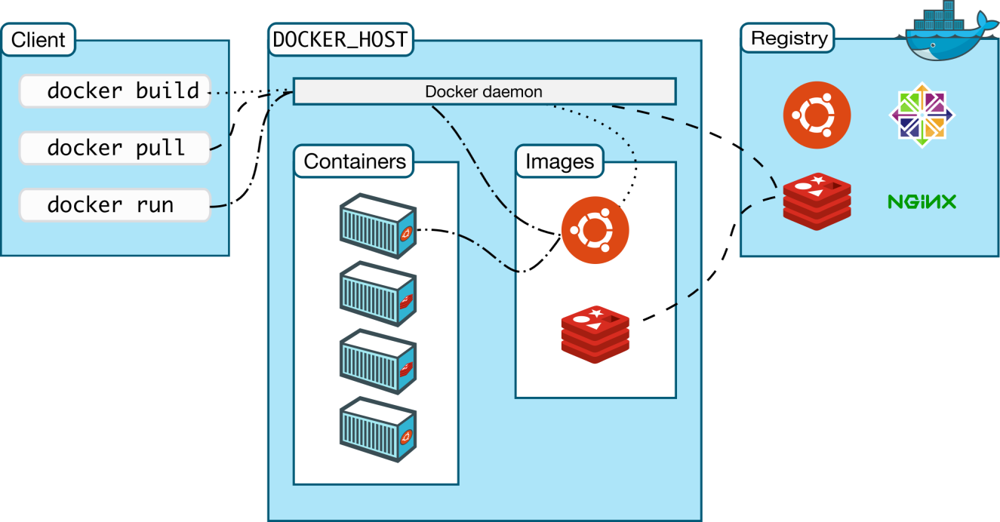
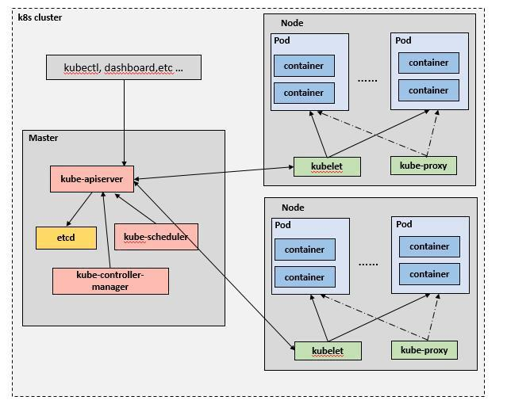
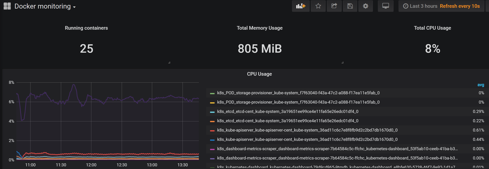
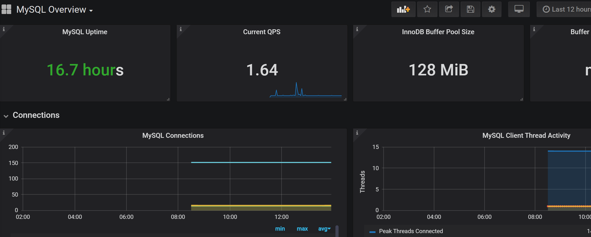

**DevOps一体化使用文档V1.0**

1.  docker使用

    1.  docker部署

传统的虚拟机是虚拟一套硬件，有自己的操作系统和应用，而docker是进程隔离的虚拟，共享宿主机的资源，容器内的资源是隔离的。

**容器**其实就是一种特殊的进程，容器是一个单进程模型。

**Namespace :**隔离 Namespace
技术实际上修改了应用进程看待整个计算机“视图”，即它的“视线”被操作系统做了限制，只能“看到”某些指定的内容

**Linux Cgroups** ：限制
它最主要的作用，就是限制一个进程组能够使用的资源上限，包括
CPU、内存、磁盘、网络带宽等等。

**\*Namspace有几种**

UTS 主机和域名

IPC 信号量、消息队列和共享内容

PID 进程编号

network 网络设备、网络栈、端口等

mount 挂载点(文件系统)

user 用户和用户组

**\*基本概念**

docker镜像就是一个只读模板，比如，一个镜像可以包含一个完整的centos，里面仅安装apache或用户的其他应用，镜像可以用来创建docker容器，另外docker提供了一个很简单的机制来创建镜像或者更新现有的镜像，用户甚至可以直接从其他人那里下周一个已经做好的镜像来直接使用。

docker利用容器来运行应用，容器是从镜像创建的运行实例，它可以被启动，开始、停止、删除、每个容器都是互相隔离的，保证安全的平台，可以吧容器看做是要给简易版的linux环境（包括root用户权限、镜像空间、用户空间和网络空间等）和运行再其中的应用程序

仓库是存储镜像文件的地方，分为公有和私有。

**\*Docker四种网络模式**

host模式 –net=host 容器和宿主机共享Network namespace。

container模式 –net=container:NAME_or_ID 容器和另外一个容器共享Network
namespace。 kubernetes中的pod就是多个容器共享一个Network namespace。

none模式 –net=none 容器有独立的Network
namespace，但并没有对其进行任何网络设置，如分配veth pair 和网桥连接，配置IP等。

bridge模式 –net=bridge （默认为该模式）

**依次执行：**

wget
https://download.docker.com/linux/centos/7/x86_64/stable/Packages/containerd.io-1.2.0-3.el7.x86_64.rpm

wget
https://download.docker.com/linux/centos/7/x86_64/stable/Packages/docker-ce-cli-18.09.0-3.el7.x86_64.rpm

wget
https://download.docker.com/linux/centos/7/x86_64/stable/Packages/docker-ce-18.09.0-3.el7.x86_64.rpm

wget
https://download.docker.com/linux/centos/7/x86_64/stable/Packages/docker-ce-selinux-17.03.3.ce-1.el7.noarch.rpm

wget https://webank-ai-1251170195.cos.ap-guangzhou.myqcloud.com/docker-compose

rpm -ivh containerd.io-1.2.0-3.el7.x86_64.rpm

rpm -ivh docker-ce-selinux-17.03.3.ce-1.el7.noarch.rpm

rpm -ivh docker-ce-cli-18.09.0-3.el7.x86_64.rpm

rpm -ivh docker-ce-18.09.0-3.el7.x86_64.rpm

systemctl enable docker

usermod -G docker app

systemctl start docker

systemctl stop docker

sleep 5

mkdir -p /data/docker

mv /var/lib/docker/\* /data/docker

cd /var/lib

rm -rf docker

ln -s /data/docker /var/lib/docker

ls -l docker

systemctl start docker

usermod -G docker app

systemctl restart docker.service

docker ps -a

cp docker-compose /usr/local/bin

chmod +x /usr/local/bin/docker-compose

## 1.2 配置镜像加速器

在 /etc/docker/daemon.json 中写入如下内容

{"registry-mirrors":["https://docker.mirrors.ustc.edu.cn"]}

systemctl daemon-reload

systemctl restart docker

docker info

## 1.3 配置register私有仓库

docker pull registry

docker run -d -v /data/registry:/var/lib/registry -p 5000:5000 --restart=always
--privileged=true --name registry registry:latest

**\*\*在其他节点 root用户下执行\*\***

vim /etc/docker/daemon.json加入

{

​ "registry-mirrors": ["https://njrds9qc.mirror.aliyuncs.com"],

​ "insecure-registries":["192.168.0.1:5000"]

}

systemctl daemon-reload

systemctl restart docker

## 1.4 Dockerfile

**\*注意事项**

1) 创建用户-使用非root运行容器

2）配置使用可信镜像源

3）使用最小的基础镜像，不安装任何多余的软件包

4）使用 CPOY 指令不用 ADD 指令

5）Dockerfile 中不应包含密码、密钥等信息

**\*实例1.mysql镜像组建**

**\*my.cnf**

[client]

port = 3306

default-character-set=utf8

socket = /tmp/mysql.sock

[mysql]

port = 3306

default-character-set=utf8

socket = /tmp/mysql.sock

[mysqld]

user = mysql

basedir = /data/projects/common/mysql

datadir = /data/projects/common/mysql/data

port = 3306

character_set_server=utf8

pid-file = /data/projects/common/mysql/mysqld.pid

socket = /tmp/mysql.sock

server-id = 1

**\*Dockerfile**

FROM centos:7

RUN mkdir -p /data/projects/common/mysql

ADD mysql-5.6.20.tar.gz /data/projects/common

WORKDIR /data/projects/common/mysql-5.6.20/

RUN yum -y update

RUN yum -y install \\

cmake \\

ncurses \\

ncurses-devel \\

bison \\

gcc gcc-c++ \\

perl \\

autoconf \\

make

RUN useradd -s /sbin/nologin mysql

RUN cmake \\

\-DCMAKE_INSTALL_PREFIX=/data/projects/common/mysql \\

\-DMYSQL_UNIX_ADDR=/tmp/mysql.sock \\

\-DSYSTEMD_PID_DIR=/data/projects/common/mysql \\

\-DDEFAULT_CHARSET=utf8 \\

\-DDEFAULT_COLLATION=utf8_general_ci \\

\-DWITH_INNOBASE_STORAGE_ENGINE=1 \\

\-DWITH_ARCHIVE_STORAGE_ENGINE=1 \\

\-DWITH_BLACKHOLE_STORAGE_ENGINE=1 \\

\-DWITH_PERFSCHEMA_STORAGE_ENGINE=1 \\

\-DMYSQL_DATADIR=/data/projects/common/mysql/data

RUN make && make install

RUN chown -R mysql:mysql /data/projects/common/mysql/

RUN rm -rf /etc/my.cnf

ADD my.cnf /etc

ENV PATH /data/projects/common/mysql/bin:/data/projects/common/mysql/lib:\$PATH

WORKDIR /data/projects/common/mysql

RUN scripts/mysql_install_db --user=mysql --basedir=/data/projects/common/mysql/
--datadir=/data/projects/common/mysql/data

EXPOSE 3306

CMD ["/data/projects/common/mysql/bin/mysqld_safe"]

**\*Docker操作**

docker build -t mysql:centos .

docker run --name=mysql_server -d -P --privileged mysql:centos

docker exec -it 容器id /bin/bash

mysql -u root -p

Enter password: \#此处直接回车

grant all privileges on \*.\* to 'root'\@'%' identified by 'abc123';

grant all privileges on \*.\* to 'root'\@'localhost' identified by 'abc123';

flush privileges

exit

**\*实例2-Nginx**

FROM centos:7

RUN yum -y install vim net-tools bridge-utils firewalld bc iotop bc gcc gcc-c++
glibc glibc-devel pcre pcre-devel openssl openssl-devel zip unzip zlib-devel
lrzsz tree ntpdate telnet lsof tcpdump wget libevent libevent-devel
systemd-devel bash-completion traceroutepsmisc

RUN mkdir -p /data/projects/common/nginx

RUN useradd nginx -s /sbin/nologin -u 2000

ADD nginx-1.14.2.tar.gz /data/projects/common

RUN cd /data/projects/common/nginx-1.14.2 && ./configure
--prefix=/data/projects/common/nginx --user=nginx --group=nginx
--with-http_ssl_module --with-http_v2_module --with-http_realip_module
--with-http_stub_status_module --with-http_gzip_static_module --with-pcre
--with-stream --with-stream_ssl_module --with-stream_realip_module && make &&
make install && ln -sv /data/projects/common/nginx/sbin/nginx /usr/sbin/nginx

CMD ["nginx","-g","daemon off;"]

EXPOSE 80

EXPOSE 443

## 1.5 docker-compose

version: "3"

services:

xxx:

image: "xxx"

ports:

\- "xxx:xxx"

\- "xxx:xxx"

volumes:

\- "./xxx/log:/xxx/logs"

\- "./xxx/data:/xxx"

container_name: xxx

xxx:

image: "xxx"

links:

\- xxx

ports:

\- "xxx:xxx"

depends_on:

\- xxx

volumes:

\- "./xxx/log:/xxx/logs"

\- "./xxx:/xxx"

container_name: xxx

nohup docker-compose -f docker_xxx.yml up &

docker-compose -f docker_xxx.yml down

## 1.6 docker常用命令

docker save保存的是镜像（image），docker export保存的是容器（container）；

docker load用来载入镜像包，docker import用来载入容器包，但两者都会恢复为镜像；

docker load不能对载入的镜像重命名，而docker import可以为镜像指定新名称。

docker save mysql:latest -o mysql.tar

docker load \< mysql.tar

**容器 = 镜像 + 读写层**

docker images -a 列出所有的images

docker pull拉取

docker push推送

docker ps -a 查看运行的容器

docker exec -it xxx bash 进入容器

docker logs 查看日志

docker rm 删除一个或多个container

docker rm \`docker ps -a -q\` 删除所有的container

docker rmi 删除一个或多个image

docker start/stop/restart 开启/停止/重启container

docker build -t repo[:tag] 组建镜像，可以指定repo和可选的tag

**\*运行一个容器**

docker run --add-host=www.baidu.com:127.0.0.1 xxx -it /bin/bash 添加hosts

docker run -p 3306:3306 --name mysql -e MYSQL_ROOT_PASSWORD=123456 -d mysql

docker run -p 3306:3306 --name mysql -v /usr/app/mysql/conf:/etc/mysql

\-v /usr/app/mysql/logs:/var/log/mysql -v /usr/app/mysql/data:/var/lib/mysql

\-e MYSQL_ROOT_PASSWORD=123456 -d mysql

docker run --rm --name nginx -p 8080:80 -d nginx

docker run --rm -d -p 8081:80 --name nginx-test-web \\

\-v /home/nginx/www:/usr/share/nginx/html \\

\-v /home/nginx/conf/nginx.conf:/etc/nginx/nginx.conf \\

\-v /home/nginx/logs:/var/log/nginx nginx

1.  k8s使用

    1.  minikube安装

curl -Lo minikube
https://github.com/kubernetes/minikube/releases/download/v1.8.2/minikube-linux-amd64

chmod +x minikube && mv minikube /usr/local/bin/

minikube start \\

\--iso-url=https://kubernetes.oss-cn-hangzhou.aliyuncs.com/minikube/iso/minikube-v1.7.3.iso
\\

\--image-repository=registry.cn-hangzhou.aliyuncs.com/google_containers \\

\--registry-mirror=https://registry.docker-cn.com --driver=none

## 架构

**etcd**

用于持久化存储集群中所有的资源对象，如Node、Service、Pod、RC、Namespace等；API
Server提供了操作etcd的封装接口API，这些API基本上都是集群中资源对象的增删改查及监听资源变化的接口。

**API Server**

提供了资源对象的唯一操作入口，其他所有组件都必须通过它提供的API来操作资源数据，通过对相关的资源数据“全量查询”+“变化监听”，这些组件可以很“实时”地完成相关的业务功能。

**Controller Manager**

集群内部的管理控制中心，其主要目的是实现Kubernetes集群的故障检测和恢复的自动化工作，比如根据RC的定义完成Pod的复制或移除，以确保Pod实例数符合RC副本的定义；根据Service与Pod的管理关系，完成服务的Endpoints对象的创建和更新；其他诸如Node的发现、管理和状态监控、死亡容器所占磁盘空间及本地缓存的镜像文件的清理等工作也是由Controller
Manager完成的。

**Scheduler**

集群中的调度器，负责Pod在集群节点中的调度分配。

**Kubelet**

负责本Node节点上的Pod的创建、修改、监控、删除等全生命周期管理，同时Kubelet定时“上报”本Node的状态信息到API
Server里。

**Proxy**

实现了Service的代理与软件模式的负载均衡器。

**Node**作为集群中的工作节点，运行真正的应用程序，在Node上Kubernetes管理的最小运行单元是Pod。Node上运行着Kubernetes的Kubelet、kube-proxy服务进程，这些服务进程负责Pod的创建、启动、监控、重启、销毁、以及实现软件模式的负载均衡。

Node包含的信息：

Node地址：主机的IP地址，或Node ID。

Node的运行状态：Pending、Running、Terminated三种状态。

Node Condition：…

Node系统容量：描述Node可用的系统资源，包括CPU、内存、最大可调度Pod数量等。

其他：内核版本号、Kubernetes版本等。

查看Node信息：

kubectl describe node

**Pod**是Kubernetes最基本的操作单元，包含一个或多个紧密相关的容器，一个Pod可以被一个容器化的环境看作应用层的“逻辑宿主机”；一个Pod中的多个容器应用通常是紧密耦合的，Pod在Node上被创建、启动或者销毁；每个Pod里运行着一个特殊的被称之为Pause的容器，其他容器则为业务容器，这些业务容器共享Pause容器的网络栈和Volume挂载卷，因此他们之间通信和数据交换更为高效，在设计时我们可以充分利用这一特性将一组密切相关的服务进程放入同一个Pod中。

同一个Pod里的容器之间仅需通过localhost就能互相通信。

一个Pod中的应用容器共享同一组资源：

PID命名空间：Pod中的不同应用程序可以看到其他应用程序的进程ID；

网络命名空间：Pod中的多个容器能够访问同一个IP和端口范围；

IPC命名空间：Pod中的多个容器能够使用SystemV IPC或POSIX消息队列进行通信；

UTS命名空间：Pod中的多个容器共享一个主机名；

Volumes（共享存储卷）：Pod中的各个容器可以访问在Pod级别定义的Volumes；

Pod的生命周期通过Replication
Controller来管理；通过模板进行定义，然后分配到一个Node上运行，在Pod所包含容器运行结束后，Pod结束。

Kubernetes为Pod设计了一套独特的网络配置，包括：为每个Pod分配一个IP地址，使用Pod名作为容器间通信的主机名等。

在Kubernetes的世界里，虽然每个Pod都会被分配一个单独的IP地址，但这个IP地址会随着Pod的销毁而消失，这就引出一个问题：如果有一组Pod组成一个集群来提供服务，那么如何来访问它呢？Service！

**一个Service**可以看作一组提供相同服务的Pod的对外访问接口，Service作用于哪些Pod是通过Label
Selector来定义的。

拥有一个指定的名字（比如my-mysql-server）；

拥有一个虚拟IP（Cluster IP、Service
IP或VIP）和端口号，销毁之前不会改变，只能内网访问；

能够提供某种远程服务能力；

被映射到了提供这种服务能力的一组容器应用上；

如果Service要提供外网服务，需指定公共IP和NodePort，或外部负载均衡器；

**NodePort**

系统会在Kubernetes集群中的每个Node上打开一个主机的真实端口，这样，能够访问Node的客户端就能通过这个端口访问到内部的Service了

**Volume**是Pod中能够被多个容器访问的共享目录。

**Label**以key/value的形式附加到各种对象上，如Pod、Service、RC、Node等，以识别这些对象，管理关联关系等，如Service和Pod的关联关系。

**RC（Replication Controller）**

目标Pod的定义；

目标Pod需要运行的副本数量；

要监控的目标Pod标签（Lable）；

Kubernetes通过RC中定义的Lable筛选出对应的Pod实例，并实时监控其状态和数量，如果实例数量少于定义的副本数量（Replicas），则会根据RC中定义的Pod模板来创建一个新的Pod，然后将此Pod调度到合适的Node上启动运行，直到Pod实例数量达到预定目标。

**Namespace**是对一组资源和对象的抽象集合，比如可以用来将系统内部的对象划分为不同的项目组或用户组。

**targetPort**

targetPort很好理解，targetPort是pod上的端口，从port和nodePort上到来的数据最终经过kube-proxy流入到后端pod的targetPort上进入容器。

**port**

这里的port表示：service暴露在cluster ip上的端口，:port
是提供给集群内部客户访问service的入口，而在集群内部，各个服务之间我们也可以通过服务名+Port来访问指定的服务，k8s内部会把服务解析到对应的pod上面。

**nodePort**

nodePort是kubernetes提供给集群外部客户访问service入口的一种方式（另一种方式是LoadBalancer），所以，:nodePort
是提供给集群外部客户访问service的入口。

## 常用命令

kubectl annotate – 更新资源的注解。

kubectl api-versions – 以“组/版本”的格式输出服务端支持的API版本。

kubectl apply – 通过文件名或控制台输入，对资源进行配置。

kubectl attach – 连接到一个正在运行的容器。

kubectl autoscale – 对replication controller进行自动伸缩。

kubectl cluster-info – 输出集群信息。

kubectl config – 修改kubeconfig配置文件。

kubectl create – 通过文件名或控制台输入，创建资源。

kubectl delete – 通过文件名、控制台输入、资源名或者label selector删除资源。

kubectl describe – 输出指定的一个/多个资源的详细信息。

kubectl edit – 编辑服务端的资源。

kubectl exec – 在容器内部执行命令。

kubectl expose – 输入replication
controller，service或者pod，并将其暴露为新的kubernetes service。

kubectl get – 输出一个/多个资源。

kubectl label – 更新资源的label。

kubectl logs – 输出pod中一个容器的日志。

kubectl namespace -（已停用）设置或查看当前使用的namespace。

kubectl patch – 通过控制台输入更新资源中的字段。

kubectl port-forward – 将本地端口转发到Pod。

kubectl proxy – 为Kubernetes API server启动代理服务器。

kubectl replace – 通过文件名或控制台输入替换资源。

kubectl rolling-update – 对指定的replication controller执行滚动升级。

kubectl run – 在集群中使用指定镜像启动容器。

kubectl scale – 为replication controller设置新的副本数。

kubectl stop – （已停用）通过资源名或控制台输入安全删除资源。

kubectl version – 输出服务端和客户端的版本信息。

Kubectl top 查看监控

## 2.4 helm使用

**\*创建chart包**

**helm create myapp**

myapp - chart 包目录名

├── charts - 依赖的子包目录，里面可以包含多个依赖的chart包

├── Chart.yaml - chart定义，可以定义chart的名字，版本号信息。

├── templates - k8s配置模版目录， 我们编写的k8s配置都在这个目录，
除了NOTES.txt和下划线开头命名的文件，其他文件可以随意命名。

│ ├── deployment.yaml

│ ├── \_helpers.tpl -
下划线开头的文件，helm视为公共库定义文件，主要用于定义通用的子模版、函数等，helm不会将这些公共库文件的渲染结果提交给k8s处理。

│ ├── ingress.yaml

│ ├── NOTES.txt - chart包的帮助信息文件，执行helm
install命令安装成功后会输出这个文件的内容。

│ └── service.yaml

└── values.yaml - chart包的参数配置文件，模版可以引用这里参数。

**helm install ./myapp**

1.  promethus使用

    1.  promethus部署

wget
https://github.com/prometheus/prometheus/releases/download/v2.10.0/prometheus-2.10.0.linux-amd64.tar.gz

tar xvf prometheus-2.10.0.linux-amd64.tar.gz

mv prometheus-2.10.0.linux-amd64 /usr/local/prometheus

cd /usr/local/prometheus

vim prometheus.yml

scrape_configs:

\- job_name: 'prometheus'

static_configs:

\# 监控本地及端口

\- targets: ['192.168.66.129:9090']

注：Prometheus从目标机上通过http方式拉取采样点数据,
它也可以拉取自身服务数据并监控自身的健康状况。

启动服务

./prometheus --config.file=prometheus.yml

\# 指定配置文件

\--config.file="prometheus.yml"

\# 指定监听地址端口

\--web.listen-address="0.0.0.0:9090"

\# 最大连接数

\--web.max-connections=512

\# tsdb数据存储的目录，默认当前data/

\--storage.tsdb.path="data/"

\# premetheus 存储数据的时间，默认保存15天

\--storage.tsdb.retention=15d

查看暴露指标：http://192.168.66.129:9090/metrics

其他参数

\# 控制对admin HTTP API的访问，其中包括删除时间序列等功能

\--web.enable-admin-api

\# 支持热更新，直接执行localhost:9090/-/reload立即生效

\--web.enable-lifecycle

\# 热更新

curl -X POST http://prometheous_ip:9090/-/reload

访问自带Web

自带Web默认http://192.168.66.129:9090

## prometheus 监控docker

**cAdvisor（Container Advisor）用于收集正在运行的容器资源使用和性能信息。**

docker run \\

\--volume=/:/rootfs:ro \\

\--volume=/var/run:/var/run:ro \\

\--volume=/sys:/sys:ro \\

\--volume=/var/lib/docker/:/var/lib/docker:ro \\

\--volume=/dev/disk/:/dev/disk:ro \\

\--publish=8080:8080 \\

\--detach=true \\

\--name=cadvisor \\

\--restart=always \\

google/cadvisor:latest

**修改配置文件prometheus.yml，最后一行添加**

\- job_name: 'docker'

static_configs:

\- targets: ['192.168.66.129:8080']

labels:

instance: docker

重启prometheus

访问http://192.168.66.129:9090/targets

Granfana配置数据源-prometheus，导入https://grafana.com/dashboards/193监控图表

3.3prometheus监控mysql

wget
https://github.com/prometheus/node_exporter/releases/download/v0.14.0/node_exporter-0.14.0.linux-amd64.tar.gz

tar xvf node_exporter-0.14.0.linux-amd64.tar.gz /usr/local/

nohup /usr/local/node_exporter-0.14.0.linux-amd64/node_exporter &

wget
https://github.com/prometheus/mysqld_exporter/releases/download/v0.10.0/mysqld_exporter-0.10.0.linux-amd64.tar.gz

\$ tar xvf mysqld_exporter-0.10.0.linux-amd64.tar.gz /usr/local/

vim /usr/local/mysqld_exporter-0.10.0.linux-amd64/.my.cnf

[client]

user=root

password=1

nohup /usr/local/mysqld_exporter-0.10.0.linux-amd64/mysqld_exporter
--config.my-cnf="/usr/local/mysqld_exporter-0.10.0.linux-amd64/.my.cnf" &

cd /usr/local/prometheus/

vim prometheus.yml加入

\- job_name: 'linux'

static_configs:

\- targets: ['192.168.66.129:9100']

\- job_name: 'mysql'

static_configs:

\- targets: ['192.168.66.129:9104']

重启prometheus

访问http://192.168.66.129:9090/targets

Granfana导入监控https://grafana.com/grafana/dashboards/7362图表

1.  Granfana使用

    1.  部署

wget https://dl.grafana.com/oss/release/grafana-6.1.4-1.x86_64.rpm

sudo yum localinstall grafana-6.1.4-1.x86_64.rpm

**\*配置文件**

/etc/grafana/grafana.ini

**\*日志文件**

/var/log/grafana/grafana.log

**\*默认sqlite3数据库**

/var/lib/grafana/grafana.db

**\*Systemd方式启动Grafana**

systemctl daemon-reload

systemctl start grafana-server

systemctl status grafana-server

**\*修改密码**

sqlite3 /var/lib/grafana/grafana.db

\#查看数据库中包含的表

.tables

\#查看user表内容

select \* from user;

\#重置admin用户的密码为默认admin

update user set password =
'59acf18b94d7eb0694c61e60ce44c110c7a683ac6a8f09580d626f90f4a242000746579358d77dd9e570e83fa24faa88a8a6',
salt = 'F3FAxVm33R' where login = 'admin';

\#退出sqlite3

.exit

自带web：http://192.168.66.129:3000/
